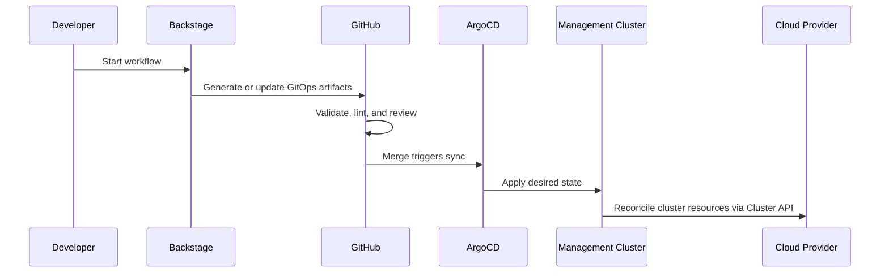

# GitOps Model

The repository's `gitops-repo-structure/README.md` describes a fleet-management pattern centered on management clusters per cloud provider.

## Core model

- One management cluster per cloud provider.
- One Git repository per workload cluster.
- ArgoCD reconciles desired state from Git.
- Backstage orchestrates creation, discoverability, and Day 2 requests.

## Why this is a strong pattern

- Platform concerns stay centralized in management clusters.
- Workload ownership remains visible and reviewable per cluster repository.
- ArgoCD provides reconciliation semantics instead of imperative scripts.
- The portal gives developers a product surface over the underlying control plane.

## Reference flow

## Repo alignment

The docs site should stay opinionated about this flow because it is central to how developers reason about the platform.

That means any future changes to:

- management cluster topology
- repo generation shape
- ArgoCD registration model
- approval and promotion flow

should be documented here first.

## Read next

- [Platform architecture](../reference/platform-architecture.md)
- [Repository map](../reference/repository-map.md)
- [Templates reference](../reference/templates.md)