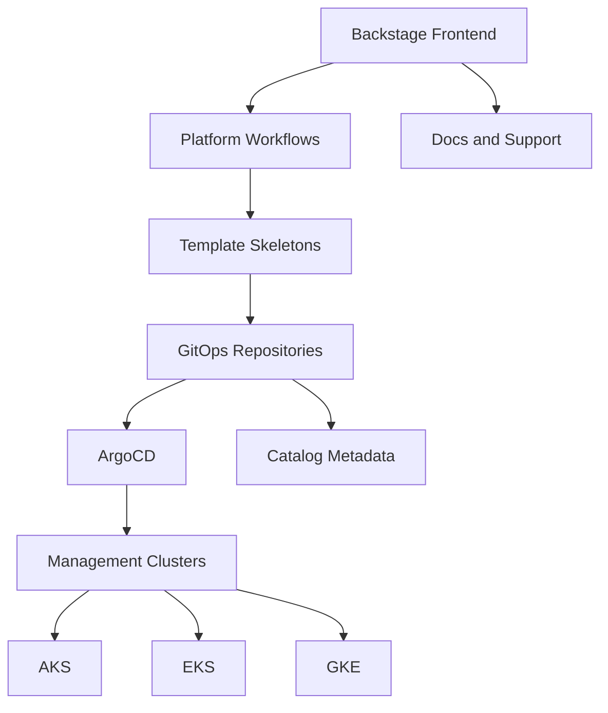

# Platform Architecture

This repository spans application UI, scaffolding, GitOps, and fleet management concerns. A useful architecture model is to think in four layers.

## Layer 1: Product surface

The Backstage frontend in `packages/app/src/` defines the user-facing platform. It contains routes and pages for:

- dashboard
- clusters
- security
- monitoring
- cost
- docs
- support
- DORA metrics
- AI chat
- add-ons and tools

## Layer 2: Workflow engine

Templates in `templates/` define controlled ways to create or change infrastructure-related artifacts. They are the main self-service contract of the platform.

## Layer 3: GitOps operating model

The `gitops-repo-structure/` reference explains the intended repository topology for management clusters, workload cluster repos, policies, and shared add-ons.

## Layer 4: Catalog and discoverability

The `catalog/` directory and `catalog-info.yaml` files define how entities show up in Backstage and how documentation can be attached using TechDocs.

## Architecture diagram

## What to change when evolving the architecture

| Goal | Primary area to edit |
| --- | --- |
| Add a new visible product area | `packages/app/src/App.tsx` and corresponding component directory |
| Add a new self-service workflow | `templates/` plus workflow docs |
| Change GitOps conventions | `gitops-repo-structure/` and template output |
| Improve discoverability | catalog entities and TechDocs annotations |

## Architecture rule of thumb

If a change affects how developers reason about the platform, it belongs in this Docusaurus site even if the implementation happens elsewhere.