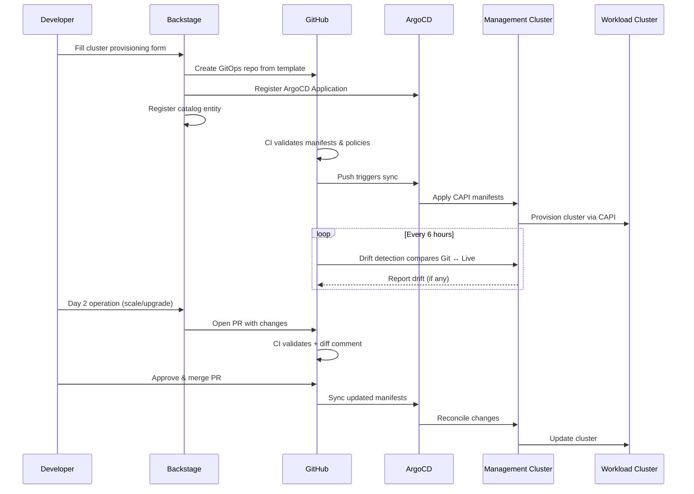

# KaaS GitOps Repository Structure

> **Morgan Stanley — Kubernetes as a Service Platform**
>
> This document describes the overall GitOps repository structure that powers the
> Kubernetes as a Service (KaaS) platform built on Backstage, Cluster API, and ArgoCD.

---

## Overview

The KaaS platform follows a **fleet management** pattern where:

- **One management cluster per CSP** (Azure, AWS, GCP) runs Cluster API controllers
- **One Git repository per workload cluster** contains the full declarative state
- **ArgoCD** on each management cluster reconciles cluster definitions from Git
- **Backstage** provides the self-service portal for provisioning and Day 2 operations

---

## Directory Structure

```
gitops-repo-structure/
│
├── management-clusters/                  # Management cluster configurations
│   ├── azure/                            # Azure management cluster (runs CAPZ)
│   │   ├── kustomization.yaml            # Kustomize base for Azure mgmt cluster
│   │   ├── capi-system/                  # CAPI core controller
│   │   ├── capz-system/                  # CAPZ (Azure) provider
│   │   ├── argocd/                       # ArgoCD instance config
│   │   ├── cert-manager/                 # Certificate management
│   │   └── monitoring/                   # Management cluster monitoring
│   │
│   ├── aws/                              # AWS management cluster (runs CAPA)
│   │   ├── kustomization.yaml            # Kustomize base for AWS mgmt cluster
│   │   ├── capi-system/                  # CAPI core controller
│   │   ├── capa-system/                  # CAPA (AWS) provider
│   │   ├── argocd/                       # ArgoCD instance config
│   │   ├── cert-manager/                 # Certificate management
│   │   └── monitoring/                   # Management cluster monitoring
│   │
│   └── gcp/                              # GCP management cluster (runs CAPG)
│       ├── kustomization.yaml            # Kustomize base for GCP mgmt cluster
│       ├── capi-system/                  # CAPI core controller
│       ├── capg-system/                  # CAPG (GCP) provider
│       ├── argocd/                       # ArgoCD instance config
│       ├── cert-manager/                 # Certificate management
│       └── monitoring/                   # Management cluster monitoring
│
├── workload-cluster-repos/               # One repo per cluster (generated by Backstage)
│   │
│   │   # Example: k8s-cluster-dev-trading-platform
│   ├── <env>-<cluster-name>/
│   │   ├── .github/workflows/           # CI/CD workflows
│   │   │   ├── cluster-provision.yaml   # Provision on push to main
│   │   │   ├── cluster-validate.yaml    # PR validation
│   │   │   └── cluster-drift-detection.yaml  # Scheduled drift check
│   │   ├── cluster-definition.yaml      # CAPI Cluster + infra resources
│   │   ├── argocd-app.yaml              # ArgoCD Application manifest
│   │   ├── catalog-info.yaml            # Backstage catalog entity
│   │   ├── README.md                    # Auto-generated documentation
│   │   └── addons/                      # Day 2 add-ons
│   │       ├── kube-prometheus-stack.yaml
│   │       ├── namespace-operator.yaml
│   │       ├── network-policies.yaml
│   │       └── vault-config.yaml
│   │
│   └── ...                              # Additional cluster repos
│
├── platform-opa-policies/               # Shared OPA/Rego policies
│   ├── pci-dss/                         # PCI-DSS compliance rules
│   │   ├── network_policies.rego
│   │   ├── secrets_management.rego
│   │   ├── rbac.rego
│   │   └── encryption.rego
│   ├── kubernetes/                      # General K8s best-practice rules
│   │   ├── resource_limits.rego
│   │   ├── image_policy.rego
│   │   └── labels.rego
│   └── data/                            # Policy data files
│
├── shared-addons/                       # Helm charts / manifests for cluster add-ons
│   ├── kube-prometheus-stack/
│   ├── nginx-ingress/
│   ├── istio/
│   ├── vault-agent/
│   ├── network-policies/
│   ├── namespace-operator/
│   ├── cert-manager/
│   ├── external-dns/
│   └── kyverno/
│
└── backstage-templates/                 # Backstage scaffolder templates
    ├── kubernetes-cluster/              # Provision a new cluster
    ├── cluster-scale/                   # Scale an existing cluster
    ├── cluster-upgrade/                 # Upgrade Kubernetes version
    ├── cluster-destroy/                 # Decommission a cluster
    ├── namespace-request/               # Request a namespace
    └── addon-management/               # Enable/disable add-ons
```

---

## Component Descriptions

### Management Clusters

Each CSP has a single management cluster that runs:

| Component | Purpose |
|---|---|
| **Cluster API (CAPI)** | Declarative cluster lifecycle management |
| **CSP Provider** | CAPZ (Azure), CAPA (AWS), or CAPG (GCP) |
| **ArgoCD** | GitOps reconciliation of workload cluster definitions |
| **cert-manager** | TLS certificate automation |
| **Monitoring** | Prometheus + Grafana for management cluster health |

Management clusters are **not** provisioned by this platform — they are pre-existing
infrastructure managed by the platform engineering team.

### Workload Cluster Repositories

Each workload cluster gets its own Git repository, generated by the Backstage
scaffolder template. The repository contains:

| File | Purpose |
|---|---|
| `cluster-definition.yaml` | Full CAPI manifest (Cluster, ControlPlane, MachinePools) |
| `argocd-app.yaml` | ArgoCD Application registered on the management cluster |
| `catalog-info.yaml` | Backstage catalog entity for discoverability |
| `addons/*.yaml` | Day 2 add-on configurations selected during provisioning |
| `.github/workflows/*` | CI/CD for validation, provisioning, and drift detection |
| `README.md` | Auto-generated cluster documentation |

### Platform OPA Policies

Shared [Open Policy Agent](https://www.openpolicyagent.org/) policies enforced
during CI (via Conftest) and at runtime (via Kyverno/Gatekeeper):

- **PCI-DSS**: Network segmentation, encryption, access control, audit logging
- **Kubernetes**: Resource limits, image provenance, required labels, pod security

### Shared Add-ons

Reusable Helm value overlays and Kustomize patches for cluster add-ons.
Referenced by workload cluster repos and parameterized during scaffolding.

---

## DNS Conventions

| CSP | Dev | QA | Prod |
|-----|-----|----|------|
| **Azure** | `*.az-dev.ms.com` | `*.az-qa.ms.com` | `*.az.ms.com` |
| **AWS** | `*.aws-dev.ms.com` | `*.aws-qa.ms.com` | `*.aws.ms.com` |
| **GCP** | `*.gcp-dev.ms.com` | `*.gcp-qa.ms.com` | `*.gcp.ms.com` |

---

## GitOps Flow



---

## Authentication

All CI/CD workflows use **OIDC federated identity** — no long-lived secrets:

| CSP | Mechanism |
|-----|-----------|
| **Azure** | Workload Identity Federation via Azure AD app registration |
| **AWS** | IAM OIDC Identity Provider for GitHub Actions |
| **GCP** | Workload Identity Federation with GitHub Actions provider |

---

## Related Resources

- [Backstage Portal](https://backstage.internal.ms.com)
- [ArgoCD Dashboard](https://argocd.internal.ms.com)
- [Grafana](https://grafana.internal.ms.com)
- [Platform Runbook](https://docs.internal.ms.com/platform/kubernetes/runbook)
- [PCI-DSS Compliance Guide](https://docs.internal.ms.com/compliance/pci-dss)
